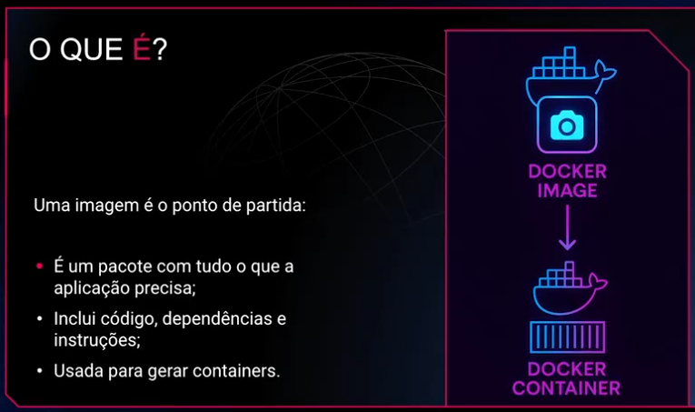
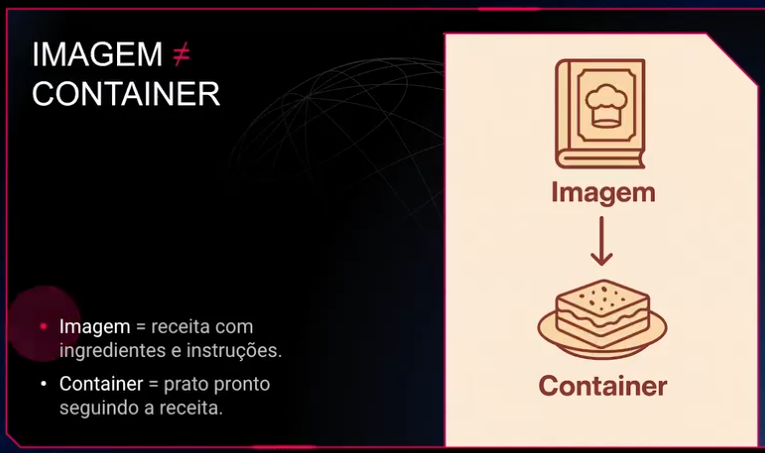
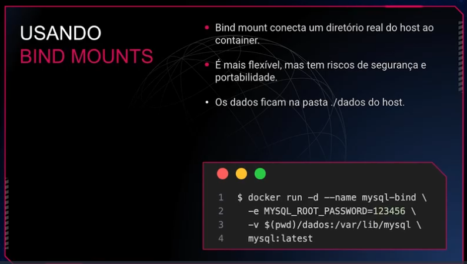
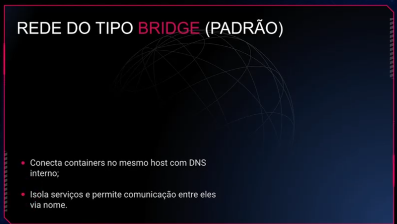
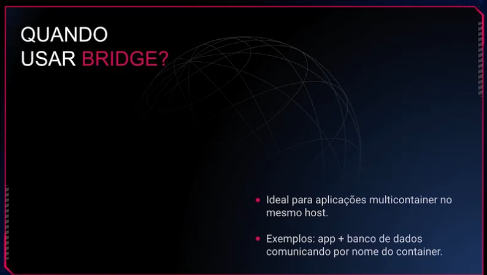
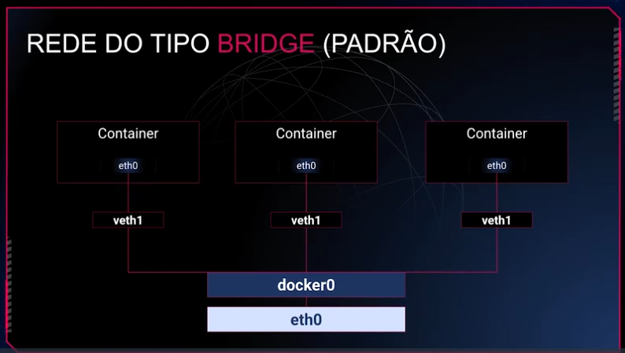
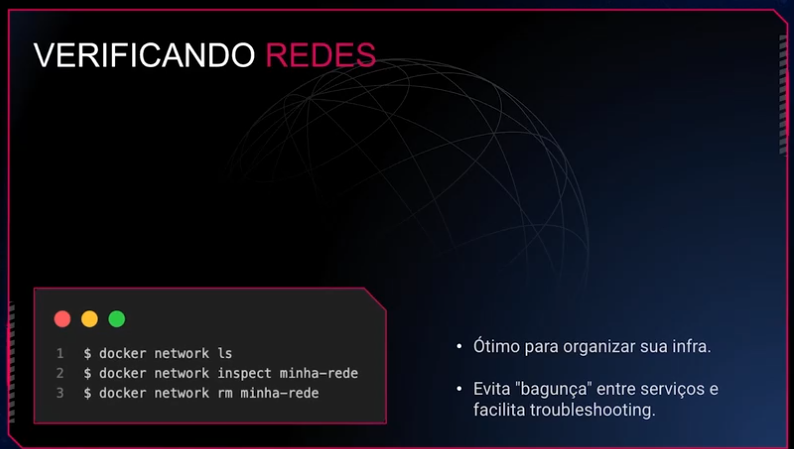

Pense em um container como uma espécie de caixinha isolada onde você coloca uma aplicação e tudo que ela precisa para rodar: bibliotecas, dependências, arquivos de configuração e recursos específicos. Essa"caixinha" fica fechada, isolada do ambiente externo, garantindo que a aplicação dentro dela sempre rode da mesma forma, não importa onde ela esteja

Tecnicamente falando, um container é um ambiente isolado no nível do sistema operacional. Diferente das máquinas virtuais (que simulam um computador completo, com sistema operacional e tudo), os containers compartilham o kernel (núcleo) do sistema operacional do host. Isso significa que containers não precisam carregar um sistema inteiro para funcionar — eles reutilizam o que já existe no host, reduzindo drasticamente o uso de recursos.

## Dois mecanismos principais do kernel Linux tornam isso possível:

### Namespaces: 
são responsáveis por criar ambientes isolados. Por exemplo, cada container tem seu próprio espaço para processos, rede, sistema de arquivos e usuários. Isso garante que um container não interfira no outro e que aplicações possam rodar lado a lado, sem conflitos;

### Cgroups (ControlGroups): 
são utilizados pra controlar a quantidade de recursos (memória, CPU, disco) que cada container pode utilizar. Assim, mesmo que um container tente consumir mais recursos que o previsto, ele fica limitado ao que foi definido, garantindo estabilidade ao sistema inteiro.

### Isso tudo importa por que? 
Porque essa combinação permite que você tenha um ambiente padronizado, previsível e extremamente portátil. Uma aplicação empacotada em um container roda exatamente do mesmo jeito na sua máquina, num servidor de teste, em produção ou até mesmo na nuvem. Isso elimina aquele velho problema de “na minha máquina funciona”.

Se você desenvolve uma aplicação web que usa Node.js em uma versão específica, antes você precisava instalar essa versão exata na máquina que rodaria sua aplicação em produção. Com containers, você simplesmente cria uma imagem que já contém exatamente essa versão do Node, as dependências e os arquivos necessários. Ao subir essa imagem num servidor (com Docker, por exemplo), você garante que tudo rode exatamente como você planejou — sem erros surpresa.






### Fluxo:


## Comandos básicos do Docker:

```
Listar containers em execução: docker ps;

Listar todos os containers (inclusive parados): docker ps –a;

Executar um container a partir de uma imagem: docker run nome-da-imagem. Exemplo: docker run hello-world;

Executar um container interativo (com acesso ao terminal): docker run -it nome-da-imagem /bin/bash. Exemplo: docker run -it ubuntu bash;

Parar um container em execução: docker stop id-ou-nome-do-container;

Iniciar novamente um container parado: docker start id-ou-nome-do-container;

Remover um container parado: docker rm id-ou-nome-do-container;

Forçar a remoção de um container (mesmo que ainda esteja rodando): docker rm -f id-ou-nome-do-container.

Listar imagens disponíveis localmente: docker images;

Baixar uma imagem específica do Docker Hub: docker pull 

nome-da-imagem. Exemplo: docker pull node:20-alpine;

Remover uma imagem localmente armazenada: docker rmi 
nome-ou-id-da-imagem.

Visualizar logs de execução do container: docker logs id-ou-nome-do-container;

Obter informações detalhadas sobre um container ou imagem: docker inspect id-ou-nome-do-container.

Renomear um container: docker rename nome-antigo nome-novo;

Executar comandos em containers já em execução: docker exec -it nome-do-container comando. Exemplo: docker exec -it meu-container bash;

Copiar arquivos do host para o container: docker cp arquivo host:/caminho-container;

Copiar arquivos do container para o host: docker cp container:/caminho-arquivo destino-host.

Remover containers parados automaticamente: docker container prune;

Remover imagens não utilizadas: docker image prune;

Limpar todos os recursos Docker não utilizados: docker system prune.

Liberar aplicação para acesso no host: docker run -p 80:80 nginx

```

### Dockerfile (FROM, RUN, CMD, COPY, WORKDIR)
Se tem uma coisa que você vai escrever muito ao trabalhar com Docker, é o tal do Dockerfile. Ele é só um arquivo de texto, mas com muito poder: é ali que você define o passo a passo para construir a imagem que vai rodar sua aplicação. Funciona como um script declarativo — você diz o que quer que aconteça e o Docker constrói.

O processo é bem linear, e com o tempo você decora a ordem das instruções. Mas no começo, vale entender o papel de cada uma.

### FROM
Tudo começa com o FROM. É aqui que você escolhe a base da sua imagem. Pode ser o Node, o Python, o Ubuntu ou qualquer outra coisa. O mais comum é usar imagens oficiais que já vêm prontas no Docker Hub.

Exemplo: FROM node:20

Isso quer dizer: “pegue a imagem do Node na versão 20 e comece a construir em cima dela”.

### WORKDIR
Depois disso, é comum definir um diretório de trabalho com WORKDIR. Isso nada mais é do que dizer: “a partir de agora, tudo que eu fizer vai ser dentro desta pasta aqui”. Isso evita que você tenha que dar comandos com caminhos longos o tempo todo.

Exemplo: WORKDIR /app

### COPY
Aí vem o COPY, que serve para colocar seus arquivos dentro da imagem. Ele seleciona o que está em sua máquina e joga dentro da imagem que está sendo construída.

Exemplo: COPY . /app

Isso copia tudo o que está no diretório atual para o /app da imagem.

### RUN
Com os arquivos no lugar, você pode executar comandos com RUN. Ele é muito usado para instalar dependências, criar pastas, mover arquivos, o que for necessário durante a construção da imagem.

Exemplo: RUN npminstall

Esse comando vai rodar dentro da imagem e o resultado fica salvo como uma camada nova.

### CMD
Por fim, vem o CMD, que define o comando que vai rodar quando o container for iniciado. É como dizer: “quando alguém rodar essa imagem, execute isso aqui por padrão”.

Exemplo: CMD ["node", "index.js"]

Isso vai rodar o index.js usando o Node quando o container subir.

A ordem dessas instruções importa, principalmente porque o Docker guarda o cache de cada etapa. Se você mudar algo no topo do Dockerfile, ele vai reconstruir tudo abaixo. Agora, se você só mexer no CMD, por exemplo, ele reaproveitará o restante.

Com o tempo você vai aprender a montar Dockerfiles mais limpos, diretos e fáceis de manter. Mas comece entendendo bem o básico: que o Dockerfile é onde você escreve a lógica de construção da sua imagem. Sem mágica, sem mistério. Só prática e clareza.

```
# Etapa 1 - build
FROM node:20 AS build
WORKDIR /app
COPY . .
RUN npm install &&npm run build

# Etapa 2 - produção
FROM node:20-slim
WORKDIR /app
COPY --from=build /app/dist ./dist
CMD ["node", "dist/index.js"]
```

A primeira etapa instala tudo, roda o build, e a segunda só carrega o resultado. Nada de node_modules, ferramentas de build ou arquivos temporários indo parar na imagem final.

Esse padrão é bem comum em projetos mais maduros, porque ajuda a deixar o deploy mais leve e evita que coisas desnecessárias (ou até perigosas) acabem indo parar em produção.

Se você ainda não usa, comece a testar em projetos pequenos. Depois que você se acostumar, vira um padrão.

### Multibuildinds


### Segurança em containers: resumo

    Containers e VMs: eles compartilham o kernel com o host, então se houver escape, o risco é grande.

    Namespaces: isolam recursos como processos, rede, usuários e sistema de arquivos, garantindo que o container veja apenas o que está dentro dele.

    Capabilities: controlam permissões do processo. O root no container é limitado por padrão. É possível remover (--cap-drop) ou adicionar (--cap-add) capacidades, seguindo o princípio do menor privilégio.

    Seccomp: funciona como um firewall de syscalls, bloqueando chamadas perigosas. O Docker já traz um perfil padrão, mas é possível criar perfis personalizados.

    Boas práticas adicionais: não rodar como root, usar imagens mínimas, manter dependências atualizadas e aplicar patches regularmente.

### Usuários não root e boas práticas de permissões

Agora vamos falar de um dos tópicos mais importantes — e muitas vezes ignorado — quando a gente começa a colocar containers em produção: rodar como root ou não. Spoiler: a resposta quase sempre é não.

Por padrão, quando você sobe um container, ele roda como root. E o root dentro do container é praticamente o mesmo root do host. Mesmo que ele esteja tecnicamente isolado, isso é um risco enorme. Se alguém conseguir escapar do container (sim, isso pode acontecer), vai ter acesso privilegiado ao seu sistema. E aí, já era.

A primeira boa prática aqui é criar um usuário não privilegiado dentro da imagem, e forçar o container a rodar com ele. Você pode fazer isso com o comando adduser (ou useradd, dependendo da imagem base) e depois usar USER nomedousuario. E mais: se os arquivos da aplicação forem copiados para o container, o ideal é já definir o dono desses arquivos com --chown.

```sh
FROM node:18-alpine
RUN adduser -D appuser
USER appuser
WORKDIR /app
COPY --chown=appuser . .
RUN npm ci
CMD ["npm", "start"]
```
### Dockerignore e build context
Quando você roda um docker build, o Docker precisa saber o que ele vai copiar para o contexto de build — basicamente, tudo que está na pasta onde você roda o comando (ou no caminho que você passar).

Isso é o chamado build context. E é aqui que muita gente se atrapalha.

Por padrão, se você não filtrar nada, o Docker vai tentar mandar tudo que está naquela pasta para o processo de build. Isso inclui .git, node_modules, arquivos grandes, segredos... tudo mesmo. Isso não só deixa o build mais lento, como também pode vazar dados sensíveis para a imagem final.

É aí que entra o .dockerignore. Ele funciona como um .gitignore, só que para build. Você lista nele o que não deve ser enviado para o build context — simples assim:

```sh
.git
node_modules
.env
.vscode
*.log
```
Com isso, o Docker ignora essas pastas e arquivos quando empacota o build context. Resultado? Build mais rápido, imagem menor e mais segura.

Aliás, se o seu build estiver demorando demais ou parecendo pesado demais, confira o que está no contexto. Muita gente manda gigas sem saber, só porque esqueceu de ignorar.

Outra boa prática é sempre rodar o docker build o mais perto possível do Dockerfile, e garantir que sua estrutura de pastas esteja organizada. Isso evita surpresas.

Enfim, usar .dockerignore é obrigatório se você quer construir imagens limpas, seguras e eficientes. Não é frescura — é parte do básico bem feito.

### Estratégias de cache em builds com npm, pip, etc

Se você já rodou um docker build mais de uma vez, talvez tenha notado: às vezes o build voa, às vezes demora uma eternidade. A diferença quase sempre está no cache.

O Docker armazena o resultado de cada instrução do Dockerfile em camadas. Se ele encontrar uma camada idêntica a uma que já construiu antes, ele reaproveita o cache e segue em frente. Só que para isso acontecer, você precisa saber como escrever o Dockerfile do jeito certo.

### Ferramentas de análise de imagem: Dive e Snyk
Ferramentas para analise de imagem, vale estudar 

### Volumes e Redes

Volumes e persistencia de dados quando container morre.













### Volumes Docker: funcionamento interno e drivers
Quando falamos em persistência de dados no Docker, inevitavelmente estamos falando de volumes. Eles são a forma oficial, segura e recomendada de manter dados fora do ciclo de vida efêmero dos containers. Mas o que realmente acontece por trás do docker volume create?

Como o Docker gerencia volumes
Quando você cria um volume, o Docker registra esse recurso em seu próprio mecanismo de metadados interno. Ele sabe onde o volume está no sistema de arquivos do host, qual driver está usando e qual container está usando aquele volume. Por padrão, esse volume é armazenado em um caminho como:

```sh
/var/lib/docker/volumes/[nome_do_volume]/_data
```

Esse _data é aquilo que o container enxerga quando você monta o volume, e o Docker se encarrega de conectar esse diretório ao caminho interno do container que você definiu, como por exemplo /var/lib/mysql.

Se estiver usando uma engine diferente, como containerd ou cri-o, o funcionamento geral segue a mesma lógica, mas o caminho físico pode variar.

### O que são drivers de volume
O Docker permite usar drivers diferentes para gerenciar onde e como os dados são armazenados. Cada driver implementa uma forma específica de criar, montar e gerenciar volumes. Os mais comuns são:

local (padrão): usa o sistema de arquivos do host. Simples, rápido e suficiente para a maioria dos casos;
nfs: permite montar volumes armazenados em servidores NFS, útil para clusters e compartilhamento em rede;
tmpfs: armazena tudo na RAM e desaparece ao reiniciar. Serve para dados temporários e testes;
drivers de terceiros: como rexray, portworx, que integram com soluções de storage enterprise como EBS, Azure Disk, Ceph, entre outros.
Você escolhe o driver no momento da criação:

```sh
docker volume create --driver local meu-volume
```

Ou, para um volume NFS:

```sh
docker volume create \
  --driver local \
  --opt type=nfs \
  --opt o=addr=192.168.1.100,rw \
--opt device=:/dados/nfs \
volume-nfs
```

### Como escolher o driver ideal
Depende do seu cenário:
```
Ambiente de desenvolvimento: use o driver local. É simples e resolve bem;

Ambiente de produção com múltiplos hosts:nfs ou outro driver remoto pode ser necessário;

Necessidade de performance de leitura/escrita em memória: tmpfs pode ser útil;

Ambiente em cloud com orquestrador: drivers especializados como rexray com EBS ou plugins CSI no Kubernetes são boas opções.

Comece com o volume local. Ele atende bem na maioria dos cenários. Só parta para opções mais complexas se houver necessidade real de compartilhamento, persistência remota ou requisitos específicos de performance.
```

### Volumes: a opção oficial, segura e portável
Volumes são gerenciados pelo próprio Docker. Quando você cria um volume com docker volume create, ele é registrado nos metadados internos do Docker e fica salvo, por padrão, em /var/lib/docker/volumes. O que o container enxerga é o diretório _data desse volume.

Pontos fortes:

- Isolamento entre containers e o host;
- Gerenciamento fácil via comandos Docker;
- Backup e migração mais simples;
- Recomendado para ambientes de produção.

```sh
docker run -d --name app \
-v dados-app:/usr/src/app/data \
  minha-imagem
```

### Bridge: o padrão que funciona para muita coisa
Quando você não especifica uma rede, o Docker automaticamente coloca seu container na rede bridge padrão. Essa rede cria um isolamento de rede dentro do host e fornece resolução de nomes entre containers.


### Criação e uso de redes personalizadas
Uma das grandes vantagens do Docker é poder simular ambientes com vários serviços isolados, mas que ainda assim precisam conversar entre si. E é exatamente aqui que entram as redes personalizadas. Com elas, você tem mais controle, isolamento e previsibilidade. Vamos entender o porquê

### Como funciona o DNS interno do Docker
Quando você cria uma rede personalizada com docker network create, o Docker automaticamente habilita um serviço de DNS interno para essa rede. Isso significa que cada container que estiver conectado a ela pode ser referenciado pelo seu nome (ou seja, o nome definido na flag --name).

```sh
docker network create minha-rede

dockerrun -d --name banco --network minha-rede postgres
```
Nesse caso, a minha-api consegue se conectar ao banco de dados usando o hostname banco, sem precisar de IP fixo, sem um “jeitinho”. O Docker cuida da resolução de nomes.

### Como containers se descobrem via hostname
Se os containers estão na mesma rede personalizada, o nome de um é visível para o outro. Isso simplifica muito a configuração de aplicações distribuídas.

Por exemplo, uma aplicação Node.js pode se conectar ao MongoDB apenas apontando a URI para mongodb://mongo:27017, assumindo que o container com o Mongo se chama mongo e ambos estão na mesma rede.

### Como isolar e expor serviços de forma segura
Redes personalizadas são isoladas por padrão. Isso significa que apenas containers conectados à mesma rede conseguem se enxergar. Com isso, você pode:

- Isolar bancos de dados, evitando que sejam acessados por containers que não deveriam;

- Separar ambientes (ex: dev e prod);

- Reduzir a superfície de ataque, limitando o tráfego entre containers.

E caso precise expor um serviço (como um frontend ou API), basta mapear a porta com -p no dockerrun, ou configurar diretamente no Docker Compose.

```sh
docker run -d --name frontend --network minha-rede -p 80:3000 minha-app
```

### Conectando e desconectando containers dinamicamente
Outro ponto importante é que você pode conectar e desconectar containers de redes a qualquer momento:

```sh
docker network connect minha-rede containerX
docker network disconnect minha-rede containerY
```

Isso permite criar arquiteturas dinâmicas, com controle fino sobre quem fala com quem.

Redes personalizadas não só organizam o tráfego entre seus containers, como também são uma ferramenta fundamental de segurança e isolamento. Entender como elas funcionam e como aproveitar o DNS interno do Docker muda completamente o jeito de estruturar suas aplicações multicontainer. E quando o projeto crescer? A mesma lógica de redes personalizadas será usada em ferramentas como Docker Compose e orquestradores como o Kubernetes.

### Segurança com usuários não-root e permissões de arquivos
Criar containers seguros vai além de configurar uma imagem funcional. Um dos pilares mais importantes na segurança de ambientes Docker é evitar que containers rodem como root, além de configurar corretamente as permissões de arquivos dentro e fora do container.

### Por que evitar o usuário root?
Quando um container é iniciado com o usuário root, ele tem permissões totais dentro daquele ambiente isolado. O problema é que, em caso de falha de segurança ou fuga de container (container breakout), esse usuário pode comprometer o host inteiro. A superfície de ataque aumenta consideravelmente.

Boas práticas:

- Nunca use root em containers que precisam interagir com dados sensíveis ou que vão rodar em produção;

- Prefira rodar com um usuário com permissões mínimas necessárias;

- Adicione esse usuário no momento da construção da imagem.

### Como criar um usuário não-root na imagem Docker
Dentro do Dockerfile, você pode criar um usuário e definir que ele será o usuário padrão do container:

```sh
FROM node:18

# Cria o usuário
RUN useradd -m appuser

# Define permissões para a pasta da aplicação
WORKDIR /app
COPY . .
RUN chown -R appuser:appuser /app

# Troca para o usuário
USER appuser

CMD ["node", "index.js"]
```

O comando USER muda o usuário efetivo usado durante a execução do container.

### Permissões de arquivos e diretórios
Mesmo com um usuário não-root, é fundamental garantir que os arquivos e pastas tenham permissões adequadas.

- Use chmod e chown corretamente durante o build da imagem;

- Garanta que arquivos sensíveis (como tokens, .env, .ssh) estejam protegidos ou fora do contexto do container;

- Ao usar volumes, saiba que o usuário do host pode ser diferente do usuário do container — e isso pode gerar problemas de permissão;

> Solução comum: mapear o mesmo UID/GID no host e no container, ou usar --user $(id -u):$(id -g) ao rodar o container.


### Evitando escalonamento de privilégio
Mesmo com um usuário não-root, containers mal configurados podem ser explorados. Algumas proteções adicionais:

- Use readOnlyRootFilesystem (em ambientes orquestrados como Kubernetes);

- Não monte o socket do Docker (/var/run/docker.sock) dentro do container;

- Use --cap-drop ALL para remover todas as capabilities Linux e adicione apenas as estritamente necessárias;

- Habilite o AppArmor, SELinux ou seccomp no seu host.

### Exemplo prático: rodando container com UID/GID definidos

```sh
docker run \
  --rm \
 --user $(id -u):$(id -g) \
-v $(pwd):/app \
  minha-imagem
```

Esse comando garante que o usuário dentro do container terá os mesmos IDs do usuário do host, evitando problemas de permissão nos volumes montados.

Evitar o uso do root e gerenciar corretamente permissões dentro dos containers são passos cruciais para criar aplicações seguras e prontas para produção. Isso reduz a superfície de ataque e garante que falhas isoladas não se transformem em brechas críticas.

A segurança começa na imagem, passa pelo runtime e se estende até o host. Portanto, cuide de cada camada com atenção!

Para compreender mais sobre o assunto, deixo aqui a sugestão de um ótimo livro:
```
“Docker: Up & Running” (3ª edição)

Autores: Sean P. Kane e Karl Matthias

Editora: O'Reilly Media

Ano: 2023
```
Esse livro é um prato cheio para quem já entende os fundamentos e quer dominar recursos como BuildKit, rootless containers, redes avançadas e integração com Kubernetes. Recomendo especialmente os capítulos sobre “Segurança”, “Redes” e “Práticas modernas de build”


## Docker Compose: Orquestração de Múltiplos Containers

Docker Compose é uma ferramenta que permite definir e executar aplicações multi-container Docker. Com ele, você usa um arquivo YAML para configurar os serviços da sua aplicação, redes e volumes. Depois, com um único comando, você sobe ou derruba todo o ambiente.

### Por que usar Docker Compose?

- **Ambientes de desenvolvimento:** Facilita a configuração de ambientes complexos com bancos de dados, filas de mensagens, e outros serviços.
- **Testes:** Garante que o ambiente de teste seja idêntico ao de produção (ou o mais próximo possível).
- **Aplicações pequenas/médias:** Ideal para orquestrar aplicações com alguns serviços sem a complexidade de Kubernetes.


Exemplo prático de docker compose no projeto abaixo em nextjs
https://github.com/viniciosneves/todo-app-aula-docker 

Criado um dockerfile:
```yml
FROM node:22 AS builder 
WORKDIR /app
COPY package*.json .
RUN npm install
COPY . .
RUN npm run build


FROM node:22-slim
WORKDIR /app
COPY package*.json .
RUN npm install
COPY --from=builder /app/dist ./dist
EXPOSE 3000
CMD ["node", "dist/main"]
```

e um dockercompose.yml:
```yml
services:
  postgres:
    image: postgres:16-alpine
    restart: unless-stopped
    ports:
      - "5432:5432"
    environment:
      POSTGRES_DB: ${DB_DATABASE:-todo_db}
      POSTGRES_USER: ${DB_USERNAME:-postgres}
      POSTGRES_PASSWORD: ${DB_PASSWORD:-postgres}
    volumes:
      - pgdata:/var/lib/postgresql/data
    networks:
      - todo-networks
  app:
    build:
      context: .
    ports:
      - "3000:3000"
    environment:
      DB_HOST: postgres
      DB_USERNAME: ${DB_USERNAME:-postgres}
      DB_PASSWORD: ${DB_PASSWORD:-postgres}
      DB_DATABASE: ${DB_DATABASE:-todo_db}
    depends_on:
      - postgres
    networks:
      - todo-networks
networks:
  todo-networks:
    driver: bridge

volumes:
  pgdata: 
```

e criado o arquivo .env:
```yml
# Database Configuration
DB_HOST=postgres
DB_PORT=5432
DB_USERNAME=postgres
DB_PASSWORD=postgres
DB_DATABASE=todo_db

# Application
PORT=3000
NODE_ENV=development
```


Um outro exemplo abaixo:

### Exemplo de `docker-compose.yml`

```yaml
version: '3.8'

services:
  web:
    build: .
    ports:
      - "80:80"
    volumes:
      - .:/app
    depends_on:
      - db
    environment:
      DATABASE_URL: postgres://user:password@db:5432/mydatabase

  db:
    image: postgres:13
    environment:
      POSTGRES_DB: mydatabase
      POSTGRES_USER: user
      POSTGRES_PASSWORD: password
    volumes:
      - db-data:/var/lib/postgresql/data

volumes:
  db-data:
```

### Comandos básicos do Docker Compose:

```
Subir todos os serviços definidos no docker-compose.yml: docker compose up

Subir os serviços em segundo plano (detached mode): docker compose up -d

Construir ou reconstruir as imagens dos serviços: docker compose build

Parar os serviços e remover os containers: docker compose down

Parar os serviços, mas manter os containers: docker compose stop

Listar os serviços em execução: docker compose ps

Visualizar os logs de todos os serviços (ou de um específico): docker compose logs [nome-do-servico]

Executar um comando em um serviço: docker compose exec [nome-do-servico] [comando]

